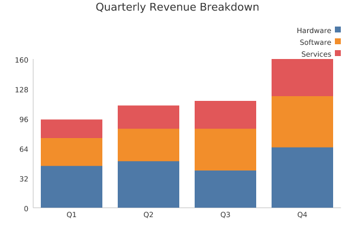
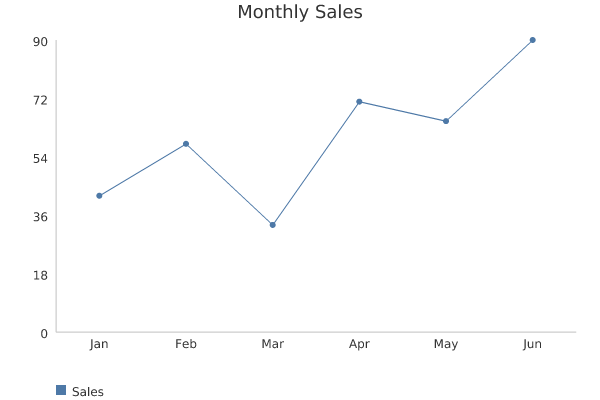
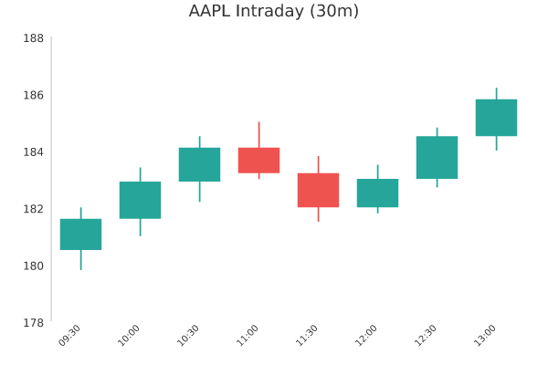

<p align="center">
  
</p>

# Plotto

[](https://hex.pm/packages/plotto)
[](https://hexdocs.pm/plotto)
[](https://github.com/altenwald/plotto/blob/main/LICENSE)
[](https://github.com/altenwald/plotto/actions/workflows/ci.yml)

Plotto is a plot library, 100% Elixir, that's focused on generating beautiful SVG charts and exporting the same chart to PNG when it's needed — including the PNG rasterizer and TrueType font renderer, no external binaries or NIFs required.

It is very useful when you are developing a website and need to integrate SVG charts. Chart data items accept arbitrary HTML/SVG attributes (`phx-click`, `data-*`, etc.), so if you are using Phoenix LiveView you can attach events, actions, and feedback to individual bars/points — without Plotto depending on Phoenix or LiveView in any way.

If you need to export or generate PNG charts for email, PDF, or sending via Telegram, Slack, Mattermost, etc., `Plotto.to_png/1` renders the same chart to a PNG binary, anti-aliased and with full Unicode text support (including accented characters like á, é, ñ) via a bundled DejaVu Sans font.

Charts can also show an optional title and a legend (one swatch + name row per series, rendering square swatches for bars/candles and line segments with solid/dashed/dotted styles for lines). The legend can be positioned in 12 directional positions (top, bottom, left, right — with left, center/middle, and right alignments) and can be oriented vertically (default) or horizontally (`legend_orientation: :horizontal`) when positioned at the top or bottom. Negative values and mixed positive/negative domains are fully supported with an automatic zero baseline.

## Usage

```elixir
# Bar chart
chart =
  Plotto.BarChart.new!(
    [%{name: "Sales", data: [%{label: "Jan", value: 10}, %{label: "Feb", value: 25}]}],
    title: "Sales"
  )

svg = Plotto.to_svg!(chart)
png = Plotto.to_png!(chart)

# Multi-line chart with dashed/dotted lines and lateral legend
line_chart =
  Plotto.LineChart.new!(
    [
      %{name: "Series A", data: [%{label: "Jan", value: 10}, %{label: "Feb", value: 30}]},
      %{name: "Series B", dashed: true, data: [%{label: "Jan", value: 5}, %{label: "Feb", value: 45}]}
    ],
    legend: :right_top,
    stroke_width: 2
  )
```

`Plotto.LineChart` supports both flat data lists (`[%{label: "Jan", value: 10}, ...]`) for single series and multi-series lists. See `Plotto.BarChart` and `Plotto.LineChart` for the full data/options shape.

## Examples

[examples/bar_chart.exs](examples/bar_chart.exs) generates the chart below (`mix run examples/bar_chart.exs`), with two series ("Revenue" and "Net Profit"), mixed positive/negative values with a zero baseline, and a top-right legend:

```elixir
data = [
  %{
    name: "Revenue",
    data: [
      %{label: "Jan", value: 42},
      %{label: "Feb", value: 58},
      %{label: "Mar", value: 33},
      %{label: "Apr", value: 71},
      %{label: "May", value: 65},
      %{label: "Jun", value: 90}
    ]
  },
  %{
    name: "Net Profit",
    data: [
      %{label: "Jan", value: 12},
      %{label: "Feb", value: 25},
      %{label: "Mar", value: -15},
      %{label: "Apr", value: 30},
      %{label: "May", value: -8},
      %{label: "Jun", value: 40}
    ]
  }
]

chart = Plotto.BarChart.new!(data, title: "Monthly Performance", legend: :top_right)
svg = Plotto.to_svg!(chart)
png = Plotto.to_png!(chart)

File.write!(Path.join(__DIR__, "bar_chart.svg"), svg)
File.write!(Path.join(__DIR__, "bar_chart.png"), png)
```


[examples/stacked_bar_chart.exs](examples/stacked_bar_chart.exs) generates a stacked bar chart (`mix run examples/stacked_bar_chart.exs` with `mode: :stacked`):

```elixir
data = [
  %{
    name: "Hardware",
    data: [
      %{label: "Q1", value: 45},
      %{label: "Q2", value: 50},
      %{label: "Q3", value: 40},
      %{label: "Q4", value: 65}
    ]
  },
  %{
    name: "Software",
    data: [
      %{label: "Q1", value: 30},
      %{label: "Q2", value: 35},
      %{label: "Q3", value: 45},
      %{label: "Q4", value: 55}
    ]
  },
  %{
    name: "Services",
    data: [
      %{label: "Q1", value: 20},
      %{label: "Q2", value: 25},
      %{label: "Q3", value: 30},
      %{label: "Q4", value: 40}
    ]
  }
]

chart =
  Plotto.BarChart.new!(
    data,
    mode: :stacked,
    title: "Quarterly Revenue Breakdown",
    legend: :top_right
  )

svg = Plotto.to_svg!(chart)
png = Plotto.to_png!(chart)

File.write!(Path.join(__DIR__, "stacked_bar_chart.svg"), svg)
File.write!(Path.join(__DIR__, "stacked_bar_chart.png"), png)
```



[examples/line_chart.exs](examples/line_chart.exs) generates a line chart with temperatures crossing negative values (`mix run examples/line_chart.exs`), with a bottom-left legend:

```elixir
data = [
  %{
    name: "Temperature",
    data: [
      %{label: "Jan", value: -5},
      %{label: "Feb", value: -2},
      %{label: "Mar", value: 8},
      %{label: "Apr", value: 15},
      %{label: "May", value: 22},
      %{label: "Jun", value: 28}
    ]
  }
]

chart = Plotto.LineChart.new!(data, title: "Monthly Temperatures (°C)", legend: :bottom_left)
svg = Plotto.to_svg!(chart)
png = Plotto.to_png!(chart)

File.write!(Path.join(__DIR__, "line_chart.svg"), svg)
File.write!(Path.join(__DIR__, "line_chart.png"), png)
```



[examples/candlestick_chart.exs](examples/candlestick_chart.exs) generates a candlestick (OHLC) financial chart (`mix run examples/candlestick_chart.exs`):

```elixir
data = [
  %{label: "09:30", open: 180.5, high: 182.0, low: 179.8, close: 181.6},
  %{label: "10:00", open: 181.6, high: 183.4, low: 181.0, close: 182.9},
  %{label: "10:30", open: 182.9, high: 184.5, low: 182.2, close: 184.1},
  %{label: "11:00", open: 184.1, high: 185.0, low: 183.0, close: 183.2},
  %{label: "11:30", open: 183.2, high: 183.8, low: 181.5, close: 182.0},
  %{label: "12:00", open: 182.0, high: 183.5, low: 181.8, close: 183.0},
  %{label: "12:30", open: 183.0, high: 184.8, low: 182.7, close: 184.5},
  %{label: "13:00", open: 184.5, high: 186.2, low: 184.0, close: 185.8}
]

chart = Plotto.CandlestickChart.new!(data, title: "AAPL Intraday (30m)")
svg = Plotto.to_svg!(chart)
png = Plotto.to_png!(chart)

File.write!(Path.join(__DIR__, "candlestick_chart.svg"), svg)
File.write!(Path.join(__DIR__, "candlestick_chart.png"), png)
```



## Tooltips, Labels and CSS Styling

Plotto charts generate clean SVG elements with standard semantic CSS classes (`plotto-chart`, `plotto-bar`, `plotto-candle`, `plotto-candle-bullish`, `plotto-candle-bearish`, `plotto-point`, `plotto-line`, `plotto-axis`, `plotto-label`, `plotto-label-bar`, `plotto-label-point`, `plotto-legend`), making it easy to style them with Tailwind, CSS variables, or dark mode themes.

### Tooltips

All charts support the `:tooltip` option:
- `:data` (default): Injects `data-title="..."` attributes onto bars, candles, and points for modern, instant JS/LiveView tooltips.
- `:native` (or `:title`): Injects `<title>...</title>` child elements for zero-JS browser tooltips and accessibility.
- `false` / `nil`: Disables automatic tooltip injection.
- `fn item -> ... end` or `fn item, series_name -> ... end`: Formats the tooltip text using a custom callback.

### Top Labels on Bars and Points

`Plotto.BarChart` and `Plotto.LineChart` support placing labels immediately above bars and line points via the `:label` option:
- `true` (or `:label`): Displays each point's category label (or stacked column category) above the element.
- `:value`: Displays formatted numeric values above each bar/point.
- `fn item -> ... end` or `fn item, series_name -> ... end`: Custom callback returning the string to display (e.g. `fn item -> "#{item.value}%" end`). Returning `nil` or `false` skips the label for that item.
- `false` (default): No labels rendered above elements.

### Legend Positions and Orientation

Plotto supports flexible legend positioning via `:legend`:
- Top: `:top_left`, `:top_center`, `:top_right`, or `:top` (alias for `:top_center`).
- Bottom: `:bottom_left`, `:bottom_center`, `:bottom_right`, or `:bottom` (alias for `:bottom_center`).
- Left: `:left_top`, `:left_middle`, `:left_bottom`.
- Right: `:right_top`, `:right_middle`, `:right_bottom`.

When positioned at the top or bottom, the layout can be configured using `:legend_orientation`:
- `:vertical` (default): stacked items vertically in a column.
- `:horizontal`: items displayed side by side horizontally in a row.

### Y-Axis Bounds and Guide Lines

Charts allow specifying minimum and maximum target bounds for the Y axis:
- `:y_max`: target maximum value for the Y axis.
- `:y_min`: target minimum value for the Y axis.
- `:y_max_soft`: boolean (default `true`). When `true`, if data points exceed `:y_max`, the Y axis dynamically expands to fit the data. When `false`, the axis is strictly capped at `:y_max`.
- `:y_min_soft`: boolean (default `false`). When `true`, if data points fall below `:y_min`, the Y axis dynamically expands downwards. When `false`, the axis is strictly bounded at `:y_min`.
- `:y_max_guide`: reference guideline drawn horizontally across the plot at `:y_max`. Can be `false` (default), `true` (dashed with theme axis color), a color string (`"#FF0000"`), or a tuple `{:solid | :dashed | :dotted, color}` (e.g. `{:dashed, "#FF0000"}`).
- `:y_min_guide`: reference guideline drawn horizontally across the plot at `:y_min`. Follows the same format as `:y_max_guide`.

### Value Prefix and Suffix

Charts support adding prefixes and suffixes to numeric values across Y-axis tick labels, point/bar tooltips (`<title>` and `data-title`), and value labels (`label: :value`):
- `:value_suffix` (or `:suffix`): string appended to numeric values (e.g. `suffix: "%"` or `suffix: " USD"`). Negative numbers are formatted properly (e.g. `"-25%"`). Defaults to `nil`.
- `:value_prefix` (or `:prefix`): string prepended to numeric values (e.g. `prefix: "$"` or `prefix: "€"`). Negative numbers format with the minus sign preceding the prefix (e.g. `"-$25"`). Defaults to `nil`.

### Grid Lines and Guidelines

Charts support drawing horizontal and vertical guidelines (grid lines) behind data points and series:
- `:y_guidelines`: horizontal guidelines drawn across the plot at each Y-axis tick mark. Can be `false` (default), `true` (dotted with theme grid color), a color string (`"#E0E0E0"`), or a tuple `{:dotted | :dashed | :solid, color}` (e.g. `{:dashed, "#CCCCCC"}`).
- `:x_guidelines`: vertical guidelines drawn across the plot at each category along the X axis. Follows the same format as `:y_guidelines`. Defaults to `false`.

## Installation

The package can be installed by adding `plotto` to your list of dependencies in `mix.exs`:

```elixir
def deps do
  [
    {:plotto, "~> 0.4.0"}
  ]
end
```

Documentation can be generated with [ExDoc](https://github.com/elixir-lang/ex_doc)
and published on [HexDocs](https://hexdocs.pm). Once published, the docs can
be found at <https://hexdocs.pm/plotto>.

## License

Plotto is licensed under the [MIT License](LICENSE).

Enjoy!

