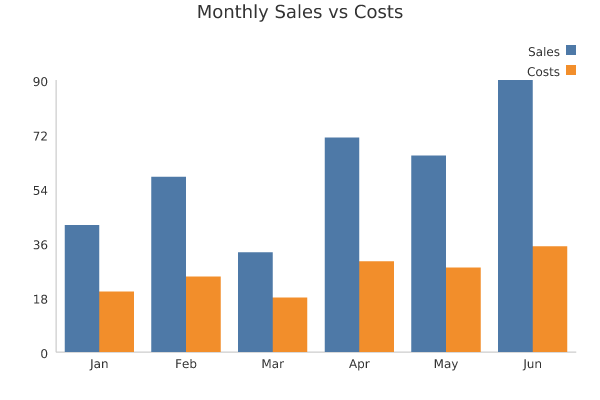

# Plotto

Plotto is a plot library, 100% Elixir, that's focused on generating beautiful SVG charts and exporting the same chart to PNG when it's needed — including the PNG rasterizer and TrueType font renderer, no external binaries or NIFs required.

It is very useful when you are developing a website and need to integrate SVG charts. Chart data items accept arbitrary HTML/SVG attributes (`phx-click`, `data-*`, etc.), so if you are using Phoenix LiveView you can attach events, actions, and feedback to individual bars/points — without Plotto depending on Phoenix or LiveView in any way.

If you need to export or generate PNG charts for email, PDF, or sending via Telegram, Slack, Mattermost, etc., `Plotto.to_png/1` renders the same chart to a PNG binary, anti-aliased and with full Unicode text support (including accented characters like á, é, ñ) via a bundled DejaVu Sans font.

## Usage

```elixir
chart = Plotto.BarChart.new!([%{label: "Jan", value: 10}, %{label: "Feb", value: 25}], title: "Sales")
svg = Plotto.to_svg!(chart)
png = Plotto.to_png!(chart)
```

`Plotto.LineChart` works the same way. See `Plotto.BarChart` and `Plotto.LineChart` for the full data/options shape.

## Example

[examples/bar_chart.exs](examples/bar_chart.exs) generates the SVG below (`mix run examples/bar_chart.exs`):

```elixir
data = [
  %{label: "Jan", value: 42},
  %{label: "Feb", value: 58},
  %{label: "Mar", value: 33},
  %{label: "Apr", value: 71},
  %{label: "May", value: 65},
  %{label: "Jun", value: 90}
]

chart = Plotto.BarChart.new!(data, title: "Monthly Sales")
svg = Plotto.to_svg!(chart)

File.write!(Path.join(__DIR__, "bar_chart.svg"), svg)
```



## Installation

The package can be installed by adding `plotto` to your list of dependencies in `mix.exs`:

```elixir
def deps do
  [
    {:plotto, "~> 0.1.0"}
  ]
end
```

Enjoy!
